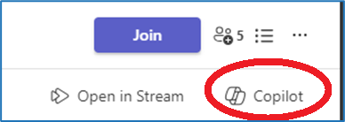

---
demo:
  title: 'デモ: Teams の Copilot'
---

[インデックスに戻る](https://microsoftlearning.github.io/MS-4012-Microsoft-Copilot-Web-Based-Interactive-Experience-for-Executives/)

# Teams の Copilot

## デモ セットアップ

スムーズなデモを実現するには、次のいずれかのセットアップ オプションを選択します。

**オプション A: 会議の要約**

このオプション用のデモ セットアップの手順については、[こちら](https://microsoft.seismic.com/Link/Content/DCFPQWmT2DMXC8WJjgjP4H44GWXG)を参照してください。 具体的には、以下のデモで参照する Teams 会議 (Project Avalon) の設定方法については、5 ページから 10 ページを参照してください。

> **重要**:
> - オプション A 用のデモ セットアップには、少なくとも 4 人 (必要に応じて 6 人) が必要です。
> - 計画された配信の前に、チームでこれを実施します。
> - 完了したら、この Teams 会議を参照して、今後の配信に活かすことができます。
> - 何らかの理由で準備作業を行うことができない場合は、オプション B のデモを参照してください。

**オプション B: Teams チャット**

このデモ オプションには、事前セットアップは必要ありません。 ただし、既存の Teams チャット スレッドのいずれかを活用する必要があります。 デモに使用する前に、このチャットで機密情報が共有されていないことを確認してください。


## オプション A - 会議の要約デモ

### テーマ

「次に、Teams で会議の要約と呼ばれるものを紹介します。

私と同僚との会議を次に示します。 機密性の理由から実際の会議を表示することはできません。ここに示すのは Project Avalon という架空の製品の発売について話しているチームの架空の会議を録画したものです。

要約は、録画の文字起こしに基づいていました。 それは、誰が関与して、いつ話していたかを示しています。 また、話していた内容の概要もあります。 Copilot は、探しているものを見つけやすくするために、セクションごとに会議を開催しました。

Copilot に質問をすると、この会議に関する詳細情報を得ることができます。 例えば、話し合われた内容と各人の課題を見てみましょう。」

### デモの手順

1. ブラウザー タブに切り替え、Microsoft Teams を開いて、会議 **Project Avalon 立ち上げ会議**を開きます。

    > **重要:**  機密データを含む会議やチャットを表示しないでください。

1. **[要約]** タブを選択します。

    

1. **スピーカー**を指し示します。
1. **トピック**を選択します。

    

1. **章**を選択します。

    

1. 右上隅にある **[Copilot]** を選択します。

    

1. **[この会議について何でも質問してください]** テキスト ボックスにプロンプトをコピーして貼り付けます。

    ```text
    Can you list action items and owners in a table?
    ```

1. **[Send]** を選択します。
1. **[この会議について何でも質問してください]** テキスト ボックスにプロンプトをコピーして貼り付けます。 

    ```text
    Did anyone strongly oppose the decision, and how do you know?
    ```
    
1. **[Send]** を選択します。
1. **[この会議について何でも質問してください]** テキスト ボックスにプロンプトをコピーして貼り付けます。

    ```text
    Based on the transcript, when would you recommend we launch the product and why?
    ```

1. **[Send]** を選択します。

## オプション B - Teams チャット

### テーマ

「ここでは、Copilot が Teams チャット エクスペリエンスを強化する方法について説明します。

私と同僚とのチャット スレッドを次に示します。 Copilot はチャットのハイライトを要約してくれるため、すべてのメッセージを読む必要なしに要点を追って行くのが簡単になります。

Copilot に質問をすると、チャットからより具体的な情報を得ることができます。 例えば、開いている項目の内容と、次の手順を進める方法を見てみましょう。

さらに、返信の下書きを作成したら、Copilot を使用して推敲し、メッセージを明確で簡潔にすることができます。 これは、チーム内で効果的なコミュニケーションを確実に行うために特に役立ちます。」

### デモの手順

1. 機密情報を共有していない Teams チャット スレッドを見つけます。 **[チャットを新しいウィンドウで開く]** オプションを選択します。

    ![[チャットを新しいウィンドウで開く] オプションを示すスクリーンショット。](../Demos/Media/teams_open_chat_window.png)

1. Teams チャットを新しいウィンドウで開いた状態で、右上隅にある **[Copilot を開く]** を選択します。

    ![Teams チャットで [Copilot を開く] を示すスクリーンショット。](../Demos/Media/teams_open_copilot.png)

1. 開いている Copilot チャット ペインで、**[過去 1 日のハイライト]*** を選択して、過去 1 日のチャットの概要を簡単に確認します。

    ![Teams チャットで [Copilot を開く] を示すスクリーンショット。](../Demos/Media/teams_highlights.png)

1. **[このチャットについて質問する]** テキスト ボックスにプロンプトをコピーして貼り付けます。 

    ```text
    What are the open items?
    ```
    > **注:**  対象者により合っていると思われる代替プロンプトの例を自由に選択してください。   

1. チャット履歴の **[メッセージを入力する]** テキスト ボックスで、返信の入力を開始します。 **まだ送信ボタンを押さないでください。**

1. 返信の下書きができたら、**[メッセージを入力する]** テキスト ボックスから Copilot を選択します。

    ![Teams チャット スレッドで [Copilot を開く] を示すスクリーンショット。](../Demos/Media/teams_open_copilot_chat.png)   

1. **[書き直す]** や **[調整する]** などの Copilot オプションを試して、さらなる Copilots の機能のデモを行います。

    ![Teams Copilot の [書き直す] と [調整する] を示すスクリーンショット。](../Demos/Media/teams_rewrite_adjust.png)     

[インデックスに戻る](https://microsoftlearning.github.io/MS-4012-Microsoft-Copilot-Web-Based-Interactive-Experience-for-Executives/)
